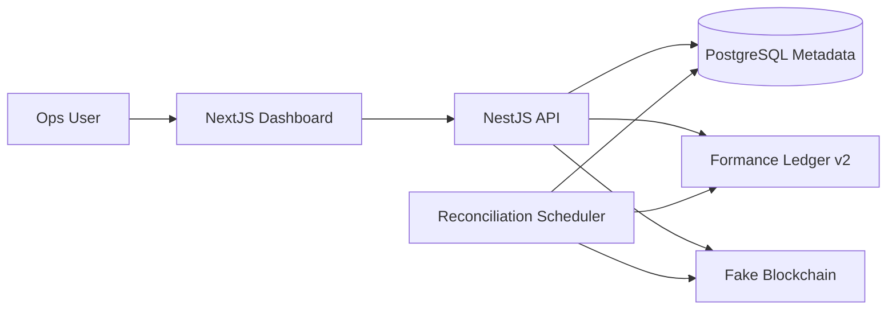
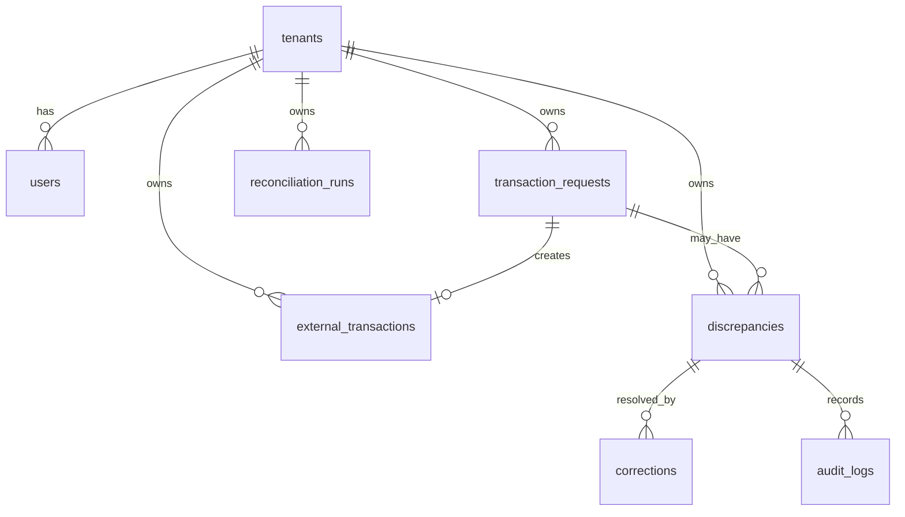
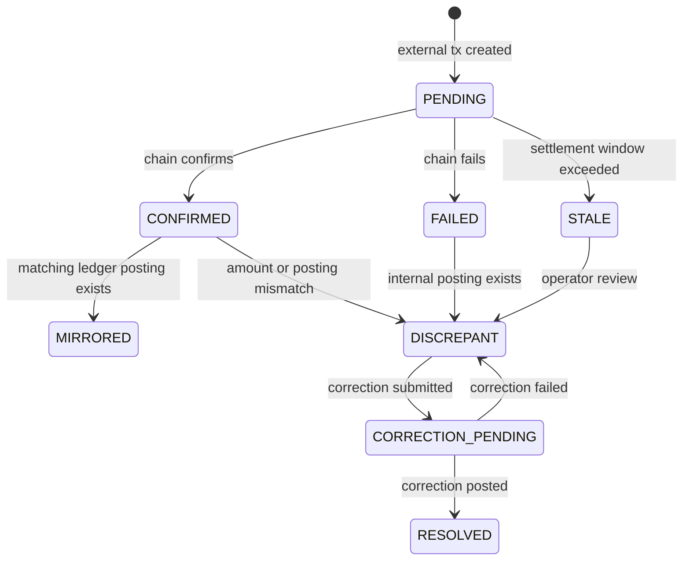

# Formance Reconciliation Engine Design

## Summary

This service is a multi-tenant reconciliation engine that keeps each company's Formance Ledger v2 ledger aligned with a simulated blockchain network. Formance is the source of truth for balances and immutable double-entry transactions. PostgreSQL stores only operational metadata: tenants, users, transaction requests, fake blockchain transaction state, reconciliation runs, discrepancies, corrections, and audit logs.

Each company gets one isolated Formance ledger. The NestJS backend owns transaction intake, account-path generation, Formance posting, fake blockchain simulation, reconciliation polling, discrepancy detection, correction booking, and reporting. The NextJS dashboard gives operations users a clear view of balances, transaction history, active reconciliation alerts, and manual correction actions.

## Architecture

Backend modules:

- `TenantsModule`: company records, ledger names, tenant context.
- `AccountsModule`: typed account builder and path validation.
- `LedgerModule`: Formance REST client, idempotency, balances, transaction history.
- `TransactionsModule`: internal transfers, deposits, withdrawals, immutable request records.
- `FakeBlockchainModule`: delayed settlement, forced outcomes, 10% failure simulation, amount drift.
- `ReconciliationModule`: polling, discrepancy detection, state transitions.
- `CorrectionsModule`: compensating ledger transactions and audit logs.
- `ReportsModule`: JSON/CSV period reports.

Frontend surfaces:

- Reconciliation alert queue with status, cause, amount delta, and age.
- Alert detail page with request metadata, external transaction, Formance transaction IDs, and audit history.
- Account browser with live Formance balances.
- Transaction history views.
- Correction form with preview, reason, amount, and submit action.
- Report export controls.

## Ledger and Account Design

Tenant isolation is modeled as one Formance ledger per company. Ledger names are stable and derived from tenant IDs, for example `company_{uuid_without_dashes}`. API calls resolve the tenant from mock auth or `X-Tenant-Id`, then use that tenant's ledger for all Formance operations.

All account paths are generated by an account builder. Application services never concatenate account strings directly.

Required templates:

| Category | Template | Purpose |
| --- | --- | --- |
| `asset` | `asset:blockchain:{chain}:{token}` | External world/blockchain assets |
| `liability` | `liability:user:{userId}:{currency}` | User wallet balances |
| `revenue` | `revenue:fees:{feeType}:{currency}` | Platform fee revenue |
| `expense` | `expense:fees:{feeType}:{currency}` | Platform fee costs and adjustments |
| `equity` | `equity:corrections:{currency}` | Operator-approved balancing corrections |

The system is USD denominated, so the first implementation validates `currency = USD`. Keeping currency in account paths makes future expansion explicit without complicating this assessment.

Core posting patterns:

| Flow | Source | Destination |
| --- | --- | --- |
| Confirmed deposit | `asset:blockchain:{chain}:USD` | `liability:user:{userId}:USD` |
| Withdrawal initiation | `liability:user:{userId}:USD` | `asset:blockchain:{chain}:USD` |
| Internal transfer | `liability:user:{fromUserId}:USD` | `liability:user:{toUserId}:USD` |
| Fee capture | `liability:user:{userId}:USD` | `revenue:fees:{feeType}:USD` |
| User over-credit correction | `liability:user:{userId}:USD` | `equity:corrections:USD` |
| User under-credit correction | `equity:corrections:USD` | `liability:user:{userId}:USD` |

All Formance postings include metadata: `tenant_id`, `transaction_request_id`, `external_tx_id`, `reconciliation_run_id`, `correction_id`, and `idempotency_key` where applicable.

## Database Schema

PostgreSQL stores workflow state and references to Formance. It does not store account balances.

Main tables:

- `tenants`: `id`, `name`, `ledger_name`, timestamps.
- `users`: `id`, `tenant_id`, `external_ref`, `display_name`, timestamps.
- `transaction_requests`: `id`, `tenant_id`, source/destination users, `type`, `requested_amount`, `currency`, `status`, `formance_transaction_id`, `idempotency_key`, `metadata`, timestamps.
- `external_transactions`: `id`, `tenant_id`, `transaction_request_id`, `chain`, `token`, `direction`, `status`, `requested_amount`, `settled_amount`, `failure_reason`, `settle_after`, `confirmed_at`, timestamps.
- `reconciliation_runs`: `id`, `tenant_id`, `status`, checked and discrepancy counts, start/end timestamps.
- `discrepancies`: `id`, `tenant_id`, request/external references, `type`, `status`, expected/actual/delta amounts, `description`, detected/resolved timestamps.
- `corrections`: `id`, `tenant_id`, `discrepancy_id`, `amount`, `currency`, `reason`, `formance_transaction_id`, `created_by`, timestamp.
- `audit_logs`: `id`, `tenant_id`, `entity_type`, `entity_id`, `action`, `message`, before/after JSON, `actor_id`, timestamp.

Important constraints:

- `tenants.ledger_name` is unique.
- `users(tenant_id, external_ref)` is unique.
- `transaction_requests.idempotency_key` is unique.
- `external_transactions.transaction_request_id` is unique when present.
- Amounts are positive decimals and currency is `USD`.
- One open discrepancy exists per transaction and discrepancy type.

## API Definition

Development requests use `X-Tenant-Id` for tenant resolution.

| Method | Path | Purpose |
| --- | --- | --- |
| `POST` | `/tenants` | Create company and ledger mapping |
| `POST` | `/users` | Create tenant user |
| `GET` | `/users` | List tenant users |
| `GET` | `/accounts` | List generated account paths |
| `GET` | `/balances/:account` | Fetch live balance from Formance |
| `GET` | `/accounts/:account/transactions` | Fetch Formance account history |
| `POST` | `/transactions` | Record internal user transfer |
| `POST` | `/deposits` | Create pending fake blockchain deposit |
| `POST` | `/withdrawals` | Post withdrawal and create external settlement request |
| `GET` | `/transactions/:id` | Show request metadata and Formance reference |
| `POST` | `/reconciliation/run` | Trigger reconciliation manually |
| `GET` | `/reconciliation/runs` | List reconciliation runs |
| `GET` | `/reconciliation/alerts` | List open discrepancies |
| `GET` | `/reconciliation/alerts/:id` | Show discrepancy detail |
| `POST` | `/reconciliation/alerts/:id/corrections` | Book compensating transaction |
| `GET` | `/reports/reconciliation` | Export JSON/CSV report for a period |
| `GET` | `/fake-blockchain/transactions/:id` | Query fake external transaction |
| `POST` | `/fake-blockchain/transactions/:id/settle` | Force test settlement outcome |

## Reconciliation State Machine

The reconciliation scheduler runs per tenant:

1. Load pending and recently changed external transactions.
2. Query the fake blockchain status.
3. Persist status and settled amount changes.
4. Mirror confirmed deposits into Formance when no mirror posting exists.
5. Compare withdrawal requested amounts against settled amounts.
6. Detect `ORPHANED_INTERNAL`, `AMOUNT_MISMATCH`, `MISSING_LEDGER_POSTING`, and `STALE_PENDING`.
7. Create or update open discrepancies and audit logs.
8. Mark matching transactions as `RECONCILED`.

Discrepancies move through `OPEN`, `ACKNOWLEDGED`, `CORRECTION_PENDING`, and `RESOLVED`. Corrections are always new compensating Formance transactions; existing committed transactions are never mutated.

## Consistency and Failure Handling

The system cannot atomically commit across PostgreSQL, Formance, and the fake blockchain, so it uses an idempotent saga:

- Store intent in PostgreSQL before external side effects.
- Use deterministic idempotency keys for Formance and fake blockchain calls.
- Store Formance transaction IDs after successful postings.
- Include local request IDs in Formance metadata so the reconciler can repair references if PostgreSQL updates fail after a successful ledger post.
- Leave failed stages retryable unless the external transaction reaches a terminal failed state.
- Use reconciliation as the repair loop for partial failures and drift.

This accepts short-lived intermediate states but keeps financial effects immutable and recoverable.

## Fake Blockchain Simulation

The fake blockchain is backed by a table for inspectability. It accepts a transaction, returns an external ID immediately, and transitions after `settle_after`.

Configurable behavior:

- Default settlement delay of 4 hours, with local override to seconds or minutes.
- Approximately 10% failed transactions.
- Optional settled amount drift to simulate gas fees or settlement variance.
- Forced settlement endpoint for manual verification.

## Reporting

Reconciliation reports include tenant, period, opening balances, account movements, closing balances, external transaction totals, discrepancies opened/resolved/still active, and booked corrections. JSON preserves nested detail for debugging. CSV flattens rows for ops review.

## Milestones

1. Design document PR.
2. NestJS scaffold, TypeORM schema, migrations, fake blockchain module, tenant/user seeds.
3. Formance client, account builder, transaction intake, balance and history APIs.
4. Reconciliation scheduler, discrepancy persistence, correction booking, reports.
5. NextJS dashboard, README, and manual verification guide.

## Trade-Offs

One ledger per tenant gives strong isolation and simple operational reasoning, but makes cross-tenant reporting an application concern. PostgreSQL intentionally avoids balances to prevent split-brain accounting, which means operational screens call Formance for live values. The saga approach avoids distributed transactions and relies on idempotent retries plus reconciliation repair. Corrections are compensating transactions because accounting history must remain immutable.
