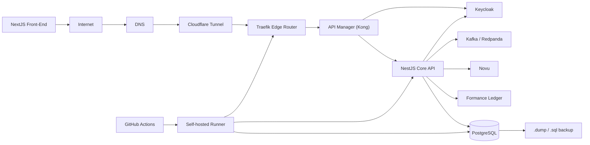

# Platform Architecture Without BFF

## Target Flow



The BFF is intentionally omitted. The front-end calls the API manager directly. The API manager owns ingress concerns such as routing, CORS, request limits, and later auth enforcement. The core API still validates bearer tokens when `AUTH_REQUIRED=true`, because financial operations should not rely only on the edge.

## Components

- Front-end: NextJS app in `apps/web`.
- Traefik: local edge router on `http://localhost:8080`.
- API Manager: Kong in DB-less mode on `http://localhost:8000`; Traefik routes `/api` to it.
- Core: NestJS API, still run locally on `localhost:3001` during development.
- Keycloak: realm `reconciliation`, admin `admin/admin`, demo user `ops@example.com/ops123`.
- Kafka: Redpanda-compatible Kafka broker exposed on `localhost:19092`.
- Novu: integrated through HTTP API when `NOVU_API_KEY` and workflow ID are configured.
- Formance: Ledger v2 from the base Compose file.
- Postgres: metadata database exposed on `localhost:55432`.
- GitHub self-hosted runner: optional CI/CD worker for private validation and deployment jobs.

## Local Platform Run

Start base financial infrastructure:

```bash
docker compose up -d postgres formance-ledger
```

Start platform edge/auth/event infrastructure:

```bash
docker compose -f docker-compose.yml -f docker-compose.platform.yml up -d traefik api-manager keycloak-db keycloak kafka
```

Start the optional GitHub self-hosted runner:

```bash
GITHUB_RUNNER_TOKEN=<registration-token> docker compose -f docker-compose.yml -f docker-compose.platform.yml --profile ci up -d github-runner
```

Start core and front-end:

```bash
cp apps/api/.env.example apps/api/.env
npm run dev --workspace api
npm run dev --workspace web
```

Useful local URLs:

- Front-end: `http://localhost:3000`
- Core API direct: `http://localhost:3001`
- API through gateway: `http://localhost:8000/api`
- API through Traefik: `http://localhost:8080/api`
- Traefik dashboard: `http://localhost:8081`
- Kong admin: `http://localhost:8001`
- Keycloak: `http://localhost:8082`

## GitHub Self-Hosted Runner

The runner is optional and belongs to the delivery plane, not the financial runtime path. Use it when a workflow needs private network access to the local platform, private Docker services, or deployment credentials that should not be exposed to GitHub-hosted runners.

Create a runner token in GitHub:

1. Open the repository in GitHub.
2. Go to Settings -> Actions -> Runners.
3. Choose New self-hosted runner.
4. Copy the registration token.

Start the runner:

```bash
GITHUB_RUNNER_REPO_URL=https://github.com/Juanjose190/reconciliation-engine \
GITHUB_RUNNER_TOKEN=<token-from-github> \
docker compose -f docker-compose.yml -f docker-compose.platform.yml --profile ci up -d github-runner
```

The workflow `.github/workflows/self-hosted-ci.yml` targets labels:

```yaml
runs-on:
  - self-hosted
  - reconciliation
```

Security notes:

- Do not attach this runner to untrusted public pull requests.
- Keep it repo-scoped unless you explicitly need an organization runner.
- Rotate the runner token if it is exposed.
- Treat Docker socket access as privileged host access.

## Auth Mode

Development mode keeps auth optional:

```env
AUTH_REQUIRED=false
```

Platform mode can require Keycloak bearer tokens:

```env
AUTH_REQUIRED=true
KEYCLOAK_ISSUER=http://localhost:8082/realms/reconciliation
KEYCLOAK_AUDIENCE=reconciliation-core
```

The imported Keycloak realm creates:

- Client `reconciliation-web`
- Bearer-only client `reconciliation-core`
- User `ops@example.com` with password `ops123`

The first front-end implementation still uses mock tenant selection. Wiring the full OIDC browser login is the next UI step.

## Eventing

The core publishes domain events to Kafka when:

- A discrepancy is opened: topic `reconciliation.discrepancies`, event `discrepancy.opened`.
- A correction is booked: topic `reconciliation.corrections`, event `correction.booked`.

If Kafka is not available, the API logs a warning and continues. Reconciliation cannot be blocked by notifications or analytics.

## Notifications

Novu is called only when the following variables are configured:

```env
NOVU_API_URL=https://api.novu.co/v1
NOVU_API_KEY=
NOVU_DISCREPANCY_WORKFLOW_ID=reconciliation-discrepancy
```

When unset, the API skips notifications. This keeps local reconciliation flows deterministic.

## Backups

Create a SQL backup:

```bash
docker compose exec postgres pg_dump -U formance reconciliation > backups/reconciliation.sql
```

Restore from SQL:

```bash
cat backups/reconciliation.sql | docker compose exec -T postgres psql -U formance reconciliation
```

For a custom-format dump:

```bash
docker compose exec postgres pg_dump -U formance -Fc reconciliation > backups/reconciliation.dump
cat backups/reconciliation.dump | docker compose exec -T postgres pg_restore -U formance -d reconciliation --clean --if-exists
```
