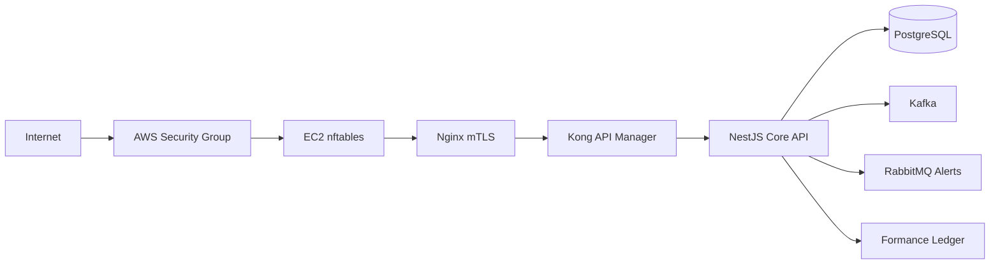

# Security and AWS Hardening

This project remains a reconciliation engine. The security requirements are applied to financial operations, tenant isolation, reconciliation alerts, and protected API ingress.

## Request Path



## EC2 Security Groups and nftables

Security Groups provide the first AWS network boundary. The EC2 host still runs `nftables` as defense in depth.

Files:

- `infra/aws/security-groups.tf`
- `infra/nftables/reconciliation.nft`
- `infra/nftables/rsyslog-nftables.conf`

Security Group intent:

- Public ingress only to HTTPS `443`.
- SSH only from an admin CIDR.
- Kafka, RabbitMQ, Postgres, and core API ports restricted to private application CIDRs.

nftables intent:

- Default drop inbound and forwarded packets.
- Allow loopback, established connections, SSH, and HTTPS.
- Log denied packets with prefix `NFT_RECONCILIATION_DENY`.
- Route matching syslog messages to `/var/log/nftables-denied.log`.

Install on EC2:

```bash
sudo cp infra/nftables/reconciliation.nft /etc/nftables.conf
sudo cp infra/nftables/rsyslog-nftables.conf /etc/rsyslog.d/30-nftables-denied.conf
sudo systemctl enable --now nftables
sudo systemctl restart rsyslog
```

## Nginx mTLS

Nginx is the TLS boundary in the strict EC2 path. It requires client certificates before forwarding `/api` to Kong and then the core API.

Files:

- `infra/nginx/nginx.conf`
- `infra/nginx/certs/README.md`

Local run:

```bash
docker compose -f docker-compose.yml -f docker-compose.platform.yml --profile edge up -d nginx-edge
```

Test with a client certificate:

```bash
curl --cert infra/nginx/certs/client.crt \
  --key infra/nginx/certs/client.key \
  --cacert infra/nginx/certs/ca.crt \
  https://localhost:8443/api/health
```

## JWT Claims and Tenant Enforcement

Tenant ownership is enforced with a `tenant_id` claim.

Expected token shape:

```json
{
  "tenant_id": "tenant-uuid",
  "scope": "read_only"
}
```

Supported scopes:

- `read_only`: can call `GET` endpoints only.
- `read_write`: can call read and mutation endpoints.
- `admin`: can cross tenant boundaries for admin operations.

The core validates:

- The bearer token signature against Keycloak JWKS.
- The token issuer and audience.
- `X-Tenant-Id` matches `tenant_id`, unless `scope=admin`.
- HTTP method is allowed by `scope`.

Implementation:

- `apps/api/src/auth/auth.guard.ts`

## 2FA

2FA is for the administration panel only. Machines and service traffic use mTLS and service credentials instead.

Keycloak imports an admin user with required TOTP setup:

- User: `admin@example.com`
- Required action: `CONFIGURE_TOTP`

The normal ops user is intended for day-to-day reconciliation operations and can be restricted by tenant and scope claims.

## Kafka and RabbitMQ

Kafka is retained for durable, high-throughput domain events:

- `reconciliation.discrepancies`
- `reconciliation.corrections`

RabbitMQ is added for operational alerts that need queue-style delivery:

- Exchange: `reconciliation.alerts`
- Routing key: `discrepancy.opened`

Implementation:

- Kafka: `apps/api/src/events/event-publisher.service.ts`
- RabbitMQ: `apps/api/src/alerts/rabbit-alert-publisher.service.ts`

## AWS Internal DNS

Traefik and Nginx are reverse proxies; they are not a replacement for DNS.

For AWS, use Route 53 Private Hosted Zones so instances communicate by names instead of IPs:

- `core.reconciliation.internal`
- `kafka.reconciliation.internal`
- `rabbitmq.reconciliation.internal`
- `postgres.reconciliation.internal`

Files:

- `infra/aws/private-dns.tf`

In production, these records should point to private load balancers, autoscaling group targets, or stable private endpoints instead of hard-coded demo IPs.

## SQL Injection Protection

The application uses TypeORM repositories and query builders instead of string-concatenated SQL. This keeps values parameterized and prevents SQL injection in normal flows.

Safe pattern:

```ts
repository.find({ where: { tenantId, id } });
```

Unsafe pattern, intentionally not used:

```ts
dataSource.query(`select * from transaction_requests where id = '${id}'`);
```

### Time-Based Blind SQLi Demo

Do not add this to the running API. Use it only as a written demonstration or isolated lab.

Attack idea against a vulnerable endpoint:

```text
'/case/when/(select/count(*)/from/users)>0/then/pg_sleep(5)/else/pg_sleep(0)/end--
```

Postgres lab query:

```sql
select case
  when (select count(*) from users) > 0 then pg_sleep(5)
  else pg_sleep(0)
end;
```

Mitigation:

- Never concatenate user input into SQL.
- Use repository methods or parameter placeholders.
- Validate DTOs with `class-validator`.
- Scope every query by `tenantId`.
- Keep database users least-privileged.

## EC2 Bootstrap

`infra/aws/ec2-user-data.sh` documents a minimal bootstrap sequence:

- Install nftables, Nginx, rsyslog, Docker.
- Enable host packet filtering.
- Route denied packet logs to file.
- Start the platform services.

The script is a starting point; production AMIs should bake these dependencies and run a deploy agent or GitHub self-hosted runner instead of pulling mutable state manually.
